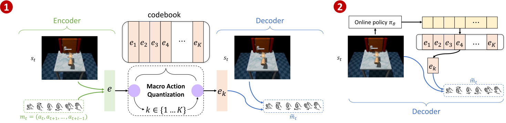
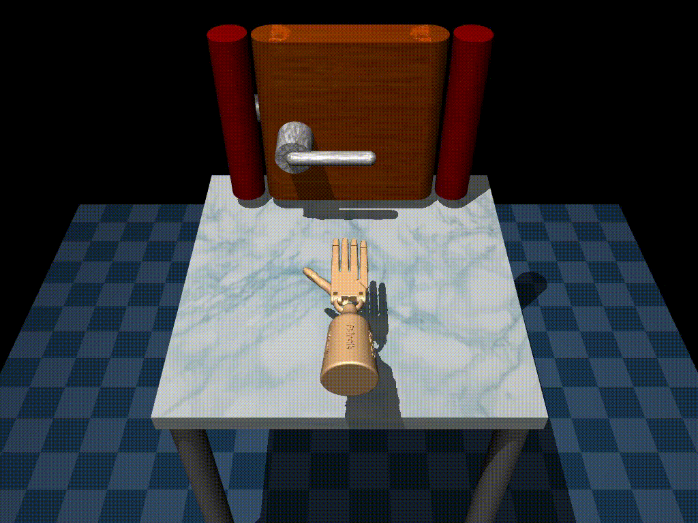
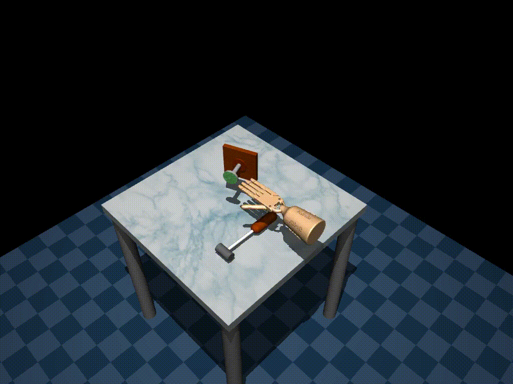

# Learning Human-Like RL Agents Through Trajectory Optimization With Action Quantization

This is the official repository of the NeurIPS 2025 paper [Learning Human-Like RL Agents Through Trajectory Optimization With Action Quantization](https://rlg.iis.sinica.edu.tw/papers/MAQ/).

If you use this work for research, please consider citing our paper as follows:
```
@inproceedings{
  guo2025learning,  
  title={Learning Human-Like RL Agents Through Trajectory Optimization With Action Quantization},
  author={Jian-Ting Guo, Yu-Cheng Chen, Ping-Chun Hsieh, Kuo-Hao Ho, Po-Wei Huang, Ti-Rong Wu, I-Chen Wu},
  booktitle={Thirty-ninth Conference on Neural Information Processing Systems},
  year={2025},
  url={https://openreview.net/forum?id=1A4Nlibwl5}
}
```



We propose a human-likeness aware framework called Macro Action Quantization (MAQ) that consists of two components: (1) Human behavior distillation and (2) Reinforcement learning with Macro Actions.

The following instructions are prepared for reproducing the main experiments in the paper.


## Human-like Reinforcement Learning 
<!-- // show the door task and hammer task, with and without MAQ in RLPD
// in the door task mention that RLPD using back hand to open the door and MAQ+RLPD (our method) using a human like way to open the door 
// in the hammer task mention that RLPD due to its the reward-drvien RL agent, they maximize the reward by hammering the nail faster leading not human like behaviors -->

Human-like reinforcement learning remains underexplored in the RL community. Most research focuses on designing reward-driven agents; only a few studies investigate human-like RL that seeks both human-like behavior and optimal performance. But most of these methods rely on pre-defined behavior constraints or rule-based penalties, requiring substanital effort for handcrafed design.
### Door Task
| MAQ+RLPD (Ours) | RLPD |
|:---:|:---:|
|  |  |
| **Human-like RL** <br> Opens the door naturally. | **Reward-driven RL** <br> Uses an unnatural "backhand" strategy to open the door, maximizing reward but sacrificing naturalness. |
### Hammer Task
| MAQ+RLPD (Ours) | RLPD |
|:---:|:---:|
|  |  |
| **Human-like RL** <br> Performs smoothly, striking the nail multiple times with controlled precision. | **Reward-driven RL** <br> Hammers aggressively fast to maximize reward, resulting in unnatural behavior. |

## Training Macro Action Quantization

### Prerequisites

The program requires a Linux platform with at least one NVIDIA GPU to operate.
For training RLPD, the CUDA version must be newer than 12.0.

### Build Programs

Clone this repository with the required submodules:
```bash
git clone --recursive ..
cd MAQ
```

Enter the container to continue the instructions:
```bash
# start the container
./scripts/start-container.sh
```

> [!NOTE]
> All the instructions must be executed in the container.

### (Optional) Preprocessing Human Demonstrations
<!-- // the dataset must store in the offline_data and can use ./offline_data/gen_offline_data.py to generate the dataset provided by d4rl
// tell them the dataset format, and if using the customize dataset must change to that format -->


> [!NOTE]
> This section is optional. If you are using a customized dataset, please review this section. If you are using the default dataset, you can skip this.

The datasets used for training and testing must be stored in the `offline_data/` folder. If you are using a customized dataset, please ensure it is stored in the `offline_data/` folder and has the same format as the following:
```python
[
    {
        'observations': np.array([...]),      # Shape: (T, obs_dim)
        'actions': np.array([...]),           # Shape: (T, action_dim)
        'rewards': np.array([...]),           # Shape: (T, )
        'next_observations': np.array([...]), # Shape: (T, obs_dim)
        'terminals': np.array([...])          # Shape: (T, )
    },
    ...
]
```
For verification, you can run:
```bash
python3 offline_data/check_dataset_format.py --dataset_path "your_dataset.pkl"
```
If the dataset is legal, it will print "is legal"; otherwise, it will print "illegal: error_message".


### Train Macro Action Quantization Methods
// MAQ+RLPD, MAQ+IQL, MAQ+DSAC
// scripts/train.sh things here


### Train Baselines
// RLPD, IQL, SAC
// scripts/train.sh things here

#### SAC
// need to metion the method using stablebaselines3 and the log file stores as...


#### IQL
// need to mention the method using ... and the log file stores as...


#### RLPD
// need to specify the instructions here, and need to mention that we have make small changes on RLPD about the dataset loading


### Train Macro Action Quantization with Different Macro Action Length and Codebook Size
// lazy_rerun.sh things here
// user can change the combination of macro action length and codebook size and methods in lazy_rerun.sh

## Evaluation
// introduce the evaluation_results
// introduce DTW/WD? 

### Evaluate Macro Action Quantization
// MAQ+RLPD, MAQ+IQL, MAQ+DSAC
// scripts/evaluate.sh things here

### Evaluate Baselines
// RLPD, IQL, SAC
// scripts/evaluate.sh things here

